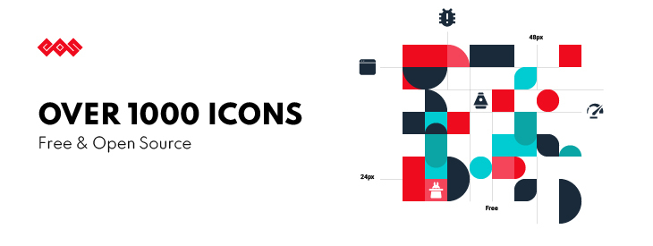
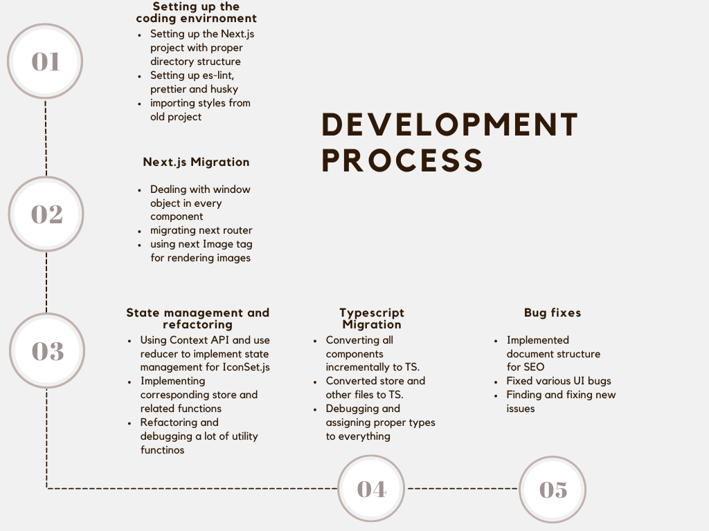

# GSOC-2022-Project-Report

Final report for Google Summer of Code - 2022 at Python Software Foundation (EOS)

## EOS Icons Next.js & TypeScript Migration

## Project Summary

**EOS icons** ars a set of **Open source, customisable, and Hi-tech icons** available for all use cases. EOS icons can be used in Figma, AdobeXd and Frontend framework like React and Vue. [eos-icons.com](https://eos-icons.com/) is the primary website where you can get all of the icons and information about them. This website contains the icons as well as the documentation for each icon and examples on how to use them.This site was initially created in React using Javascript. The goal of this project was to convert the existing website to use Next.js and TypeScript. The scope of this project also included refactoring a huge chunk of the codebase and properly implementing the state management for major UI and functional components of the site.

## Development Process

## Contributions

### EOS Icons Figma Plugin

| S No. | Contribution                                                                                                                                             |
| ----- | -------------------------------------------------------------------------------------------------------------------------------------------------------- |
| 1     | [Next.js migration ](https://github.com/EOS-uiux-Solutions/eos-icons-frontend/pull/7)                                                                    |
| 2     | [Adding custom Document page with CDN links for rendering SVGs of icons](https://github.com/EOS-uiux-Solutions/eos-icons-frontend/pull/8)                |
| 3     | [Completing all criteria for vercel sponsorship](https://github.com/EOS-uiux-Solutions/eos-icons-frontend/pull/9)                                        |
| 4     | [Implemented proper state management and fixed UI bugs](https://github.com/EOS-uiux-Solutions/eos-icons-frontend/pull/10)                                |
| 5     | [Typescript migration](https://github.com/EOS-uiux-Solutions/eos-icons-frontend/pull/13)                                                                 |
| 6     | [Putting checks for missing icons](https://github.com/EOS-uiux-Solutions/eos-icons-frontend/pull/14)                                                     |
| 7     | [updating CDN link in documentation and \_document.tsx](https://github.com/EOS-uiux-Solutions/eos-icons-frontend/pull/15)                                |
| 8     | [added next Image tag in animated icons](https://github.com/EOS-uiux-Solutions/eos-icons-frontend/pull/16)                                               |
| 9     | [Resolving issues with HowToPanel on switching tabs between Static and Animated icons](https://github.com/EOS-uiux-Solutions/eos-icons-frontend/pull/17) |
| 10    | [Added required SEO-optimizations](https://github.com/EOS-uiux-Solutions/eos-icons-frontend/pull/18)                                                     |
| 11    | [Fixed the size of animated icons](https://github.com/EOS-uiux-Solutions/eos-icons-frontend/pull/19)                                                     |

## More info about the project:

My Code Contributions <a href="https://github.com/EOS-uiux-Solutions/eos-icons-frontend/pulls?q=is%3Apr+author%3Aayushsatyam146">Contributions</a>

Project Readme <a href="https://github.com/EOS-uiux-Solutions/eos-icons-frontend/blob/master/README.md">Readme</a>

Deployed Link <a href="https://eos-icons-frontend.vercel.app/">deployment</a>

## My Journey

I have written blogs each week, documenting my journey through the entire GSOC period. You can find them here <a href="https://blogs.python-gsoc.org/en/ayushsatyam146s-blog/">GSoC 2022 Ayush Satyam Blogs</a>

## Future Work

- Adding new UI elements to the main website.
- Integrating [eos-icons-api](https://github.com/EOS-uiux-Solutions/eos-icons-api) wiht the current Next.js frontend app.
- Enhance features and fix existing bugs.

## Thank You

The previous few months have truly been wonderful! Thanks to my amazing mentors' unending support, I had a lot of fun and learnt a lot throughout this period. I have become better at writing clean and maintainable code. I try to follow best standard practices.The EOS community's participation in Google Summer of Code was by far the finest experience. I will continue to contribute to EOS.
